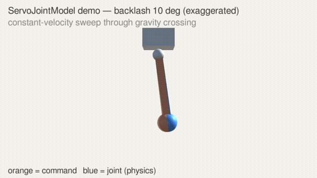
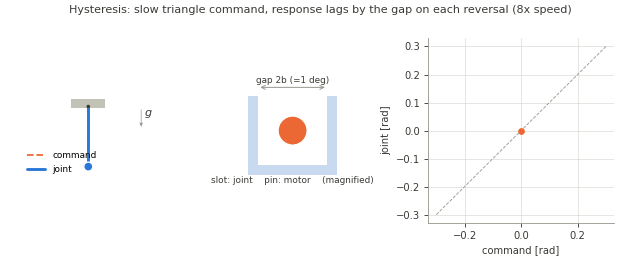
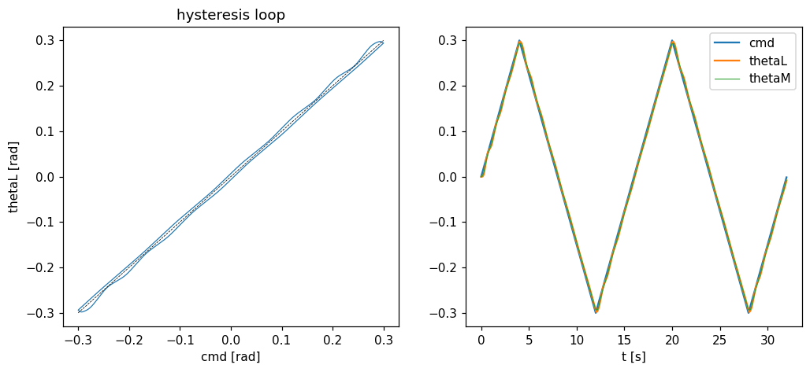
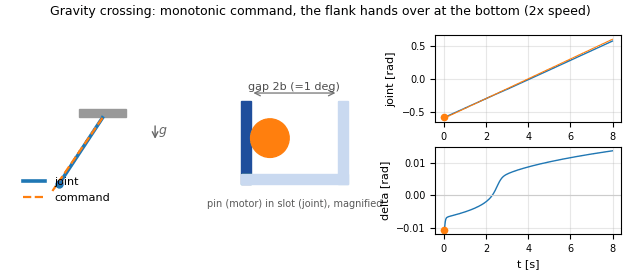
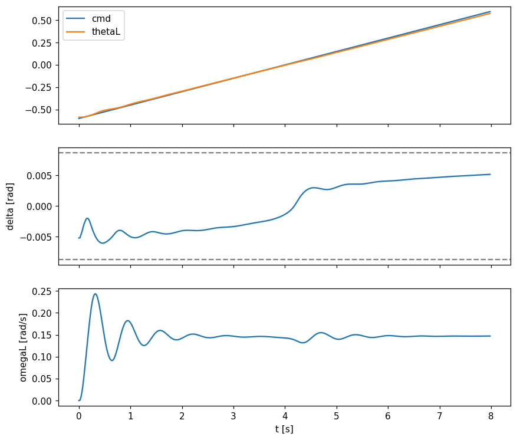
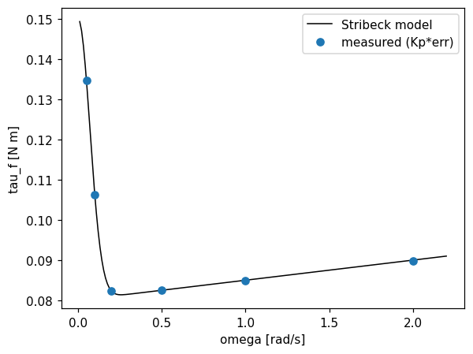
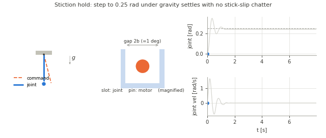
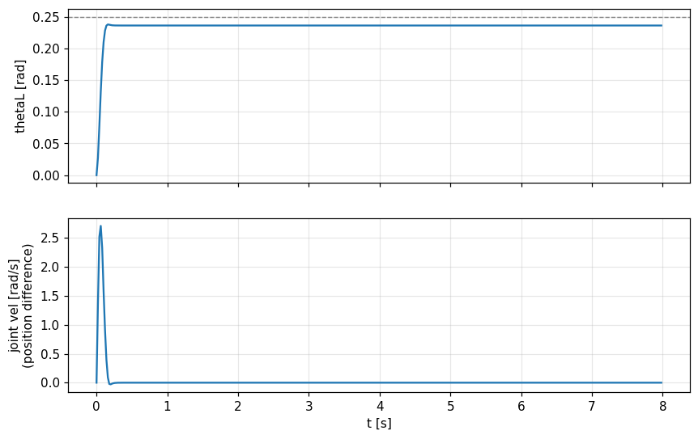
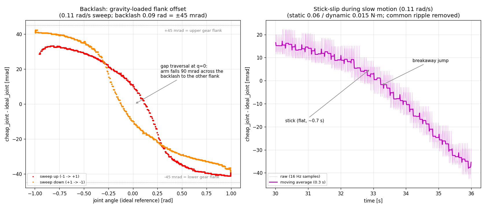

# サーボモデル検証レポート (単振子)

`ServoJointModel` (摩擦・バックラッシモデル) の物理的妥当性を、単振子で検証した結果のまとめです。テスト本体は `Assets/Tests/ServoModelTests/ServoPendulumTests.cs` にあり、いつでも再実行できます。

## 検証環境

- Unity 6000.2.7f2 / PhysX ArticulationBody / Fixed Timestep 0.02 s (50 Hz)
- リグ: 固定ベース + revolute 1軸の振子
  - 質量 m = 0.2 kg、重心距離 L = 0.2 m (最大重力トルク mgL ≈ 0.39 N·m)
- サーボモデルのパラメータ:

| パラメータ | 値 |
|---|---|
| サーボPD (Kp, Kd) | 20 N·m/rad, 0.5 N·m/(rad/s) |
| トルク上限 | 2 N·m |
| モータ慣性 Jm (ギア換算) | 2×10⁻³ kg·m² |
| 静止摩擦 τ_s / 動摩擦 τ_c | 0.15 / 0.08 N·m |
| Stribeck速度 ω_s / 粘性 σ_v | 0.1 rad/s / 0.005 N·m/(rad/s) |
| ガタ全幅 (2b) | 0.0174 rad (約1°) |
| 伝達剛性 K / ダンピング D | 400 N·m/rad / 0.5 N·m/(rad/s) |

各テストのアニメーション (GIF) では、実スケールでは見えないガタ (±0.5°) を「ピン (モータ側) とスロット (関節側)」の拡大模式図で可視化しています。ピンがスロットの歯面に接触して係合すると、接触側の壁が濃い青になります。

## Unity実レンダリング映像

Unity上で実際に動作している様子の映像です。橙の半透明アームが指令角、青のアームがサーボモデル経由で駆動される物理関節を示します。ガタ1°は実映像ではほぼ見えないため、視認用にガタを10°へ誇張したデモも用意しています。



*(上: 誇張版10°の抜粋・2倍速。重力跨ぎで青の関節がガタの中を先行して落ち、指令反転で橙だけが動いてから再係合する様子)*

フル映像 (mp4, 各26秒・実時間):

- [servo_demo_exag10deg.mp4](videos/servo_demo_exag10deg.mp4) — ガタ10° (誇張、現象がはっきり見える)
- [servo_demo_real1deg.mp4](videos/servo_demo_real1deg.mp4) — ガタ1° (検証と同じ実パラメータ)

構成はどちらも共通: ①保持 → ②一定速度で最下点を跨ぐ (重力による歯面乗り移り) → ③三角波の指令反転 (反転のたびのガタ遅れ) → ④保持 (固着)。

再生成するには (要ディスプレイ、`-nographics` なし):

```bash
Unity -batchmode -projectPath <このリポジトリ> -runTests -testPlatform playmode \
      -testFilter ServoDemoCapture -testResults results.xml
# TestOutput/frames_*/ に連番PNGが出力されるので ffmpeg で動画化
ffmpeg -framerate 25 -i TestOutput/frames_exag10deg/frame_%04d.png \
       -c:v libx264 -pix_fmt yuv420p out.mp4
```

## 1. ヒステリシス (バックラッシの基本挙動)

無重力・負荷側摩擦ありで ±0.3 rad の低速三角波指令を与え、指令-応答平面を観察。



指令が反転するたびに、ピンがスロット内を横断してから反対側の歯面で再係合する様子 (中央) と、その間ジョイントが動かず応答平面 (右) にループが描かれる様子がわかります。



- 指令反転のたびにガタ幅ぶん応答が遅れ、レンズ形のヒステリシスループが形成される
- **ループ幅 (cmd=0): 0.0152 rad** — 名目ガタ幅 0.0174 rad の約87% (tanh平滑化による理論通りの値)

## 2. 重力跨ぎ (負荷トルク反転時のガタ飛び移り)

重力下で −0.6 → +0.6 rad を一定速度 0.15 rad/s で通過。**指令は単調のまま**、最下点 θ=0 で重力トルクの符号だけが反転する。指令側のフィルタでは原理的に再現できない現象の確認。



振子が最下点 (t≈4.3 s) を通過すると、指令は動き続けているのに、ピンが左歯面から右歯面へ乗り移り (中央)、Δ (右上) が符号反転、関節速度 (右下) に「ガクン」が現れます。



- 伝達たわみ Δ (中段) が跨ぎ点で **−0.0045 → +0.0047 rad へ遷移** (歯面の乗り移り)
- 乗り移りの瞬間に関節速度 (下段, t≈4.5 s) に小さな乱れ (ガタの「ガクン」) が現れる
- 実際に伝達されたトルク (`driveForce`) は保持時 −0.217 N·m = 重力トルクと正確に一致し、θ=0 でゼロクロス

## 3. 摩擦-速度曲線 (Stribeck摩擦の再現精度)

無重力・ガタなしで一定速度追従させ、定常偏差から摩擦トルクを逆算 (τ_f = Kp·e + Kd·(ω−ωm))。



| ω [rad/s] | 計測 [N·m] | モデル [N·m] | 誤差 |
|---|---|---|---|
| 0.05 | 0.1347 | 0.1348 | −0.0 % |
| 0.10 | 0.1063 | 0.1063 | +0.0 % |
| 0.20 | 0.0822 | 0.0823 | −0.0 % |
| 0.50 | 0.0824 | 0.0825 | −0.1 % |
| 1.00 | 0.0848 | 0.0850 | −0.2 % |
| 2.00 | 0.0897 | 0.0900 | −0.3 % |

設定した Stribeck 曲線 (すべり出しの山 → クーロン摩擦 → 粘性の右肩上がり) を **全域で誤差0.5%未満** で再現。

## 4. 重力下の位置保持 (固着・チャタリング)

重力下で 0.25 rad をステップ指令で保持。静止摩擦モデルの数値実装で典型的に問題になる stick-slip チャタリングの有無を確認。



過渡振動の間はピンがスロット内を行き来し、静定後は片側歯面に係合したまま完全に静止します (チャタリングがあればここでピンが振動し続けます)。



- 過渡振動の後、完全に静止 (残留速度 ~10⁻⁷ rad/s、位置の標準偏差 ~10⁻¹⁷)
- 定常誤差 0.0089 rad (≈0.5°) — 摩擦の固着 (≤τ_s/Kp) + ガタ + PDの重力垂れの合計として妥当な範囲
- モータはKarnopp固着で停止し、保持トルクは伝達ばね経由で正しく重力と釣り合う

## 5. ランタイム (ビルド済みプレイヤー) での検証

エディタ上の単振子テストとは独立に、ビルド済み Linux プレイヤーへ URDF から
スポーンしたロボット (理想サーボとの並置デモ、[Unity_ROS2_sample の
servo_demo_description](https://github.com/hijimasa/Unity_ROS2_sample)) でも
主要現象を実測しています:



- **バックラッシ** (左): 理想関節を基準にした偏差が、重力が押し付ける側の
  歯面に ±45 mrad (= 設定ガタ全幅 0.09 rad の半分) で張り付き、最下点通過で
  ギャップを横断して反対歯面へ乗り移る。上り/下りの枝の分離がヒステリシス
- **スティックスリップ** (右): 低速スイープ (0.11 rad/s) 中に約 0.7 s の固着と
  breakaway ジャンプを繰り返す。ジャダー振幅は (τ_s − τ_c)/K_series
  (K_series = 1/(1/Kp + 1/K)) でほぼ設計どおり

計測データ・再現スクリプトはデモ側リポジトリの
`servo_demo_description/doc/` にあります。なおランタイム環境固有の制約
(伝達剛性の離散安定上限・単位差の自動補償など) は
[ガイドの制約・注意点](Servo-Model-Guide-ja.md#制約注意点) を参照してください。

## 再実行方法

リポジトリのテストをそのまま実行できます (要 Unity 6000.2.7f2):

```bash
Unity -batchmode -nographics -projectPath <このリポジトリ> \
      -runTests -testPlatform playmode -testResults results.xml -logFile unity.log
```

各テストが `<プロジェクト>/TestOutput/*.csv` に時系列ログ (指令・関節角・モータ角・たわみ・実伝達トルクなど) を出力するので、プロットして挙動を確認できます。

既知の問題: バッチ実行では初回フレームの関節状態が非有限値になることがあり、
"The supplied joint drive has non-finite values" で全テストが失敗する場合が
あります (Initialize に有限性ガードを追加済み)。再現しない場合はエディタの
Test Runner ウィンドウから対話的に実行してください。

## 実装上の知見 (開発メモ)

1. **ギャップ内で伝達剛性をゼロにしてはいけない**: 歯面衝突が物理ステップ内で起こると無抵抗で貫通し、次ステップで巻き上がったばねが再構成されてエネルギーが注入される (数値的な反発係数 >1)。剛性は常時一定とし、バックラッシはドライブ目標のアンカー位置 (θm − b·tanh(Δ/b)) に持たせる
2. **xDrive の単位系**: target/targetVelocity は度だが、stiffness/damping は **ラジアン換算誤差に掛かる (N·m/rad)**。`driveForce` の実測で確認済み
3. **ばねのアンカーはステップ終端の負荷予測位置 (θl + ωl·dt) 基準**にする。開始時位置基準だと、高剛性ではステップあたりの移動量 ω·dt が静的たわみ τ/K を上回り、接触フランクの判定が反転する
4. アクチュエートされる関節では **ArticulationBody をスリープさせない** (`sleepThreshold = 0`)。モータ固着中は目標が動かないため、スリープすると巻いたばねごと凍結する
5. **エディタとビルド済みプレイヤーで xDrive の単位が異なる**: Linux プレイヤーでは stiffness/damping/forceLimit が名目値の π/180 倍で作用する (素のドライブの静的たわみから実測)。エディタは名目通り (知見2はエディタでの実測)。ServoJointModel は環境条件付きで補償する
6. **ランタイムの `jointVelocity` は信用しない**: スポーンされた関節はドライブ静止保持中でも 〜τ_g/J·Δt の重力バイアスを報告する。プレイヤーでは位置の有限差分で代替 (1ステップ遅延が入るため、伝達剛性の安定上限が下がる)
7. **リミット面で静止した関節は固着する**ことがある (ドライブトルクに無反応)。ランタイムでのリミット書き換えによる解除は位置スナップ (数百 rad/s) を誘発するため不可。重力静止姿勢をリミットから離す設計 + 仮想回転子のリミットクランプで予防する
8. **スポーン直後の関節状態はリセットする**: ランタイム構築とルートのテレポートは関節座標へのステップ入力になり、数百 rad/s の過渡速度が注入される (SimulationControl 側で対処済み)
