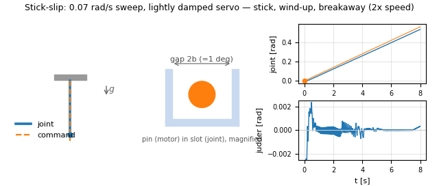
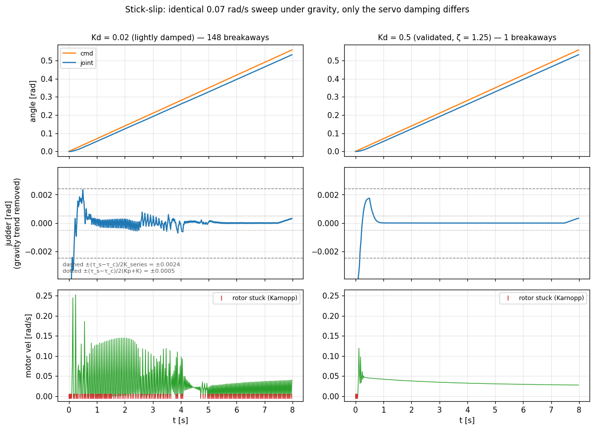

# Servo Model Validation Report (single pendulum)

Summary of the physical validation of `ServoJointModel` (friction & backlash model) using a single pendulum. The tests live in `Assets/Tests/ServoModelTests/ServoPendulumTests.cs` and can be re-run any time.

## Setup

- Unity 6000.3.21f1 / PhysX ArticulationBody / Fixed Timestep 0.02 s (50 Hz)
  (6000.2.7f2 reproduces the same numbers; for the stiffness see "Choosing the
  transmission stiffness" below)
- Rig: fixed base + one revolute pendulum
  - mass m = 0.2 kg, COM distance L = 0.2 m (max gravity torque mgL ≈ 0.39 N·m)
- Servo model parameters:

| Parameter | Value |
|---|---|
| Servo PD (Kp, Kd) | 20 N·m/rad, 0.5 N·m/(rad/s) |
| Torque limit | 2 N·m |
| Motor inertia Jm (gear-reflected) | 2×10⁻³ kg·m² |
| Static friction τ_s / Coulomb τ_c | 0.15 / 0.08 N·m |
| Stribeck velocity ω_s / viscous σ_v | 0.1 rad/s / 0.005 N·m/(rad/s) |
| Total gap (2b) | 0.0174 rad (≈1°) |
| Transmission stiffness K / damping D | 50 N·m/rad / 0.5 N·m/(rad/s) (the friction sweep alone uses K = 0.2, see below) |

The animations (GIF) visualize the gap — invisible at true scale (±0.5°) — as a magnified "pin (motor side) in slot (joint side)" schematic. When the pin engages a flank, the contacted wall turns dark blue.

Both the numbers and the figures below were re-measured with the current configuration
(K = 50, and 0.2 for the friction sweep). The plots regenerate from the CSVs with
`python3 docs/tools/plot_servo_validation.py` (see "Re-running"). `runtime_validation.png` in section 6 was re-recorded in the demo repository as well (procedure
in that section).

## Unity-rendered footage

Actual in-Unity footage of the model running. The translucent orange arm is the commanded angle; the solid blue arm is the physical joint driven through the servo model. Since a 1° gap is barely visible on camera, an exaggerated 10° demo is also provided.


*(above: excerpt of the exaggerated 10° demo, 2x speed — at the gravity crossing the blue joint falls ahead through the gap; on command reversal only the orange arm moves until the flank re-engages)*

Full videos (mp4, 26 s each, realtime):

- [servo_demo_exag10deg.mp4](videos/servo_demo_exag10deg.mp4) — 10° gap (exaggerated, clearly visible)
- [servo_demo_real1deg.mp4](videos/servo_demo_real1deg.mp4) — 1° gap (the validated real parameters)

Both follow the same choreography: hold → constant-velocity sweep through the bottom (gravity flank hand-over) → triangle-wave reversals (backlash lag) → hold (stiction).

To regenerate (requires a display, no `-nographics`):

```bash
Unity -batchmode -projectPath <this repo> -runTests -testPlatform playmode \
      -testFilter ServoDemoCapture -testResults results.xml
ffmpeg -framerate 25 -i TestOutput/frames_exag10deg/frame_%04d.png \
       -c:v libx264 -pix_fmt yuv420p out.mp4
```

## 1. Hysteresis (basic backlash behavior)

Slow ±0.3 rad triangle command under zero gravity with load-side friction.


On every command reversal the pin traverses the slot before re-engaging the opposite flank (middle) while the joint stands still, tracing the loop in the response plane (right).


- The response lags by the gap on every command reversal, forming a lens-shaped hysteresis loop
- **Loop width (at cmd=0): 0.0270 rad** — about 155 % of the nominal 0.0174 rad gap: on top
  of the gap sit the transmission deflection under the 0.05 N·m load friction and the PD sag
  (2×0.05/Kp = 0.005 rad)

## 2. Gravity crossing (flank hand-over on load-torque reversal)

Constant-velocity sweep −0.6 → +0.6 rad at 0.15 rad/s under gravity. **The command is monotonic**; only the gravity torque changes sign at the bottom. A command-side filter cannot reproduce this by construction.


As the pendulum passes the bottom (t≈4.0 s) the pin hands over from the left to the right flank (middle) while the command keeps moving, and Δ (bottom right) flips sign.


- The transmission deflection Δ (second panel) **traverses from −0.0051 to +0.0126 rad** across
  the crossing — the pin hands over from one flank to the other
- The **actually transmitted torque reverses at t = 4.12 s, θ = +0.004 rad**, i.e. exactly at the
  lowest point where the load torque changes sign. It matches gravity while holding (−0.198 N·m)
- Δ as the model reports it crosses zero earlier (t ≈ 2.3 s) because it is evaluated against the
  START-of-step load position; that is the one-step K·ω·dt bias described under "Choosing the
  transmission stiffness". The transmitted torque is the unbiased quantity
- A small disturbance appears in the joint velocity (bottom, t ≈ 2.6 s) — the backlash "clunk"

## 3. Friction-velocity curve (Stribeck accuracy)

Constant-velocity tracking without gravity or backlash; friction torque recovered from the
steady tracking error. The rotor equation is `Jm·dωm/dt = τ_servo − τ_f − τ_trans`, so at
steady state **τ_f = Kp·e + Kd·(ω−ωm) − τ_trans**. The transmission term is not negligible:
while the load is dragged at a constant speed, one step of that travel is exactly what the
dead-zone argument is stale by, and the rotor carries a residual of order K·ω·dt. Dropping the
term overestimates friction by 44 % at ω = 2 rad/s. Since this test exists to isolate the
friction, it also softens the transmission to K = 0.2 for the same reason it zeroes the gap
(at K = 2 a 7.7 % error survives even with the term included).


| ω [rad/s] | measured [N·m] | model [N·m] | error |
|---|---|---|---|
| 0.05 | 0.1348 | 0.1348 | +0.0 % |
| 0.10 | 0.1063 | 0.1063 | +0.1 % |
| 0.20 | 0.0822 | 0.0823 | −0.1 % |
| 0.50 | 0.0823 | 0.0825 | −0.2 % |
| 1.00 | 0.0847 | 0.0850 | −0.4 % |
| 2.00 | 0.0893 | 0.0900 | −0.8 % |

The configured Stribeck curve (breakaway peak → Coulomb plateau → viscous rise) is reproduced with **<0.8 % error everywhere**.

## 4. Position hold under gravity (stiction, chatter)

Step command to 0.25 rad held under gravity — the classic stress test for numerical stick-slip chatter.


During the transient the pin bounces across the slot; once settled it stays engaged on one flank and comes to a complete rest (with chatter the pin would keep oscillating here).


- After the transient the joint comes to a complete rest: over the last two seconds the joint
  position is bit-identical from step to step (position std ~10⁻¹⁶, per-step travel exactly 0).
  `jointVelocity` still reports ~0.08 rad/s throughout, but that is the permanent garbage a
  driven joint carries there, not chatter
- Steady error 0.0139 rad (≈0.8°) — consistent with stiction (≤τ_s/Kp) + gap + PD gravity sag
- The motor sticks via the Karnopp condition and the holding torque balances gravity exactly through the transmission spring

## 5. Stick-slip

Lift the pendulum against gravity at 0.07 rad/s — below the Stribeck knee (ω_s = 0.1 rad/s).
The rotor cannot slide smoothly: the Karnopp condition parks it at exactly zero, the compliance
in front of it winds up until the torque passes the breakaway value τ_s, the rotor jumps, and it
sticks again.





*(the sweep speed is identical in both columns — only the servo damping Kd differs)*

- **Whether it sustains is decided by the servo damping.** The validated Kd = 0.5 makes the
  rotor overdamped (ζ = Kd/(2·√(Kp·Jm)) = 1.25), so after one jump breaking away from rest it
  slides smoothly (**1** breakaway). Drop Kd to 0.02 and the limit cycle runs for the whole
  sweep (**148** breakaways, motor velocity cycling between 0 and 0.25 rad/s)
- The judder amplitude (with the growing gravity deflection removed) is **0.0015 rad**, between
  the two compliances the rotor can wind up against: (τ_s−τ_c)/(Kp+K) = 0.0010 and
  (τ_s−τ_c)/K_series = 0.0049 with K_series = 1/(1/Kp + 1/K). The Kd = 0.5 column sits at
  0.0003 rad, five times smaller
- This dependence is exactly why a well-damped real servo does not judder

## 6. Runtime validation (standalone player)

Independently of the editor pendulum tests, the key phenomena were also
measured on a robot spawned from URDF into the built Linux player (the
side-by-side ideal-vs-cheap servo demo in
[Unity_ROS2_sample / servo_demo_description](https://github.com/hijimasa/Unity_ROS2_sample)):


- **Backlash** (left): the deviation from an ideal reference joint sits on
  the gravity-loaded gear flank at ±45 mrad (= half of the configured
  0.09 rad gap) and traverses the gap to the other flank when the pendulum
  crosses its lowest point; the separation of the up/down branches is the
  hysteresis loop
- **Stick-slip** (right): the judder during a slow sweep (~0.1 rad/s) is
  **14 mrad p-p**, between the two compliances the rotor winds up against —
  (τ_s−τ_c)/(p_gain+K) = 8 mrad and (τ_s−τ_c)/K_series = 34 mrad, with the
  runtime parameters p_gain = 4.0, K = 2.0, τ_s−τ_c = 0.045 N·m. The
  individual stick/slip events run at ~45 cycles/s, which the 100 Hz
  `joint_states` rate cannot resolve; section 5 can, because it watches the
  50 Hz physics step directly

To re-record and re-render:

```bash
# in the container: bring the demo up and log for 70 s
bash ~/colcon_ws/scripts/capture_runtime.sh ~/simbuild \
     ~/colcon_ws/src/servo_demo_description/doc/data/runtime_capture.csv 70
# on the host: render (the sweep segments are found in the data)
python3 colcon_ws/scripts/plot_servo_validation.py
```

The dataset and both scripts live in `servo_demo_description/doc/` and
`colcon_ws/scripts/` of the demo repository. For runtime-specific constraints
(discrete stability bound on the transmission stiffness, automatic unit
compensation, etc.) see
[the guide's Limitations & notes](Servo-Model-Guide.md#limitations--notes).

## Re-running

```bash
Unity -batchmode -nographics -projectPath <this repo> \
      -runTests -testPlatform playmode -testResults results.xml -logFile unity.log
```

Each test writes time-series CSV logs (command, joint angle, motor angle, deflection, actual
transmitted torque, …) to `<project>/TestOutput/`. The figures in this document are rendered
from them:

```bash
python3 docs/tools/plot_servo_validation.py
```

**Do not use the `omegaL` column.** It is `ArticulationBody.jointVelocity` recorded verbatim,
and it does not report motion an xDrive is producing (see below). The plotting script derives
the joint velocity from the position instead and never draws `omegaL`.

### Choosing the transmission stiffness (updated 2026-08-08)

This section used to say that all four tests fail under `-batchmode -nographics`, that the
cause was the `#if UNITY_EDITOR` switch on the xDrive unit compensation, and that running
interactively made them pass. **Experiment disproved all of that.**

- The run mode is irrelevant. Dropping `-nographics`, and dropping `-batchmode` altogether to
  run the GUI Test Runner, reproduce the same failures to seven significant figures. So does
  Unity 6000.2.7f2.
- The xDrive units are irrelevant. Even in batch mode stiffness acts in N·m/rad (ratio 1.16)
  and targetVelocity is correctly converted from deg/s.
- The real cause is that **`ArticulationBody.jointVelocity` does not report motion an xDrive is
  producing.** On a plain drive sweeping a joint at a steady 0.15 rad/s it reads −0.008 rad/s.
  On a joint with no drive at all it is exact to 4e-5, which is why a free-swing check misses
  it. The model fed that value into its load-position extrapolation, which inverted the
  perceived contact flank and diverged.

`ServoJointModel` no longer reads `jointVelocity`, and the load-position extrapolation is gone.
What remains is a limit of the discretisation itself.

**The dead-zone argument needs the end-of-step load position and no delay-free estimate of it
exists.** That error reaches the joint as a torque of **K·sech²(δ/b)·ω·dt**, so the
transmission stiffness is squeezed between two opposing bounds:

- **the gap must dominate the deflection** (or the backlash tests mean nothing): `K > τ/b`
- **the discretisation error must be negligible** (or they do not match quantitatively):
  `K·ω·dt ≪ the torque being resolved`

| Test | τ [N·m] | ω [rad/s] | Lower bound | Upper bound | Window |
|---|---|---|---|---|---|
| GravityCrossing | 0.22 | 0.15 | K > 25 | K ≪ 73 | 25–73 |
| Hysteresis | 0.05 | 0.075 | K > 6 | K ≪ 33 | 6–33 |
| FrictionCurve | 0.09 | 2.0 | no backlash used | K ≪ 1 | as low as possible |

`ServoPendulumTests` therefore runs the backlash tests at **K = 50 N·m/rad** and the friction
sweep alone at **K = 0.2 N·m/rad** — that sweep runs 13× faster than any other test, so no single
value serves both, and it already zeroes the backlash to isolate the Stribeck curve. The old
K = 400 was outside every window and past the discrete stability limit (K ≈ 200–250) as well.
The K = 2 the servo_demo robot uses is comfortably inside.

**Do not assert on `jointVelocity` in tests either.** A driven joint carries a permanent floor
of about 0.08 rad/s of garbage there. `StictionHold_NoChatter` was reporting that as chatter
while the joint position was bit-identical across the same two seconds (a plain drive with no
model reports the same 0.08). It now measures a position finite difference.

All of this can be re-measured with the diagnostic probes in
`Assets/Tests/ServoModelTests/ServoEnvironmentProbe.cs`. Behaviour of the built player is
covered continuously by the servo_demo profile of the
[service conformance suite](Service-Conformance-Test.md).

## Implementation findings (dev notes)

1. **Never fade the transmission stiffness to zero inside the gap**: a flank impact inside one physics step penetrates without resistance and the re-wound spring injects energy (numerical restitution >1). Keep the stiffness constant and encode the backlash in the drive-target anchor (θm − b·tanh(Δ/b))
2. **xDrive units**: target/targetVelocity are in degrees, but stiffness/damping act on the error **converted to radians (N·m/rad)** — confirmed by measuring `driveForce`
3. **Never extrapolate the load position**: the implicit drive already solves K·(target − θl) against the end-of-step θl, so predicting θl + ωl·dt yourself double-counts it. Worse, the only velocity available for that prediction is a one-step-stale finite difference, and putting that delay into a term the stiff K multiplies makes the loop oscillate (the hold test diverges from K = 100 upwards; dropping the extrapolation stays stable through K = 800). The price is that the dead-zone argument is one step stale, leaving a torque error of K·sech²(Δ/b)·ω·dt — and that is what bounds the model's valid range
4. **Keep actuated ArticulationBodies from sleeping** (`sleepThreshold = 0`): while the motor sticks the drive target never changes, so a slept articulation freezes with a wound-up spring
